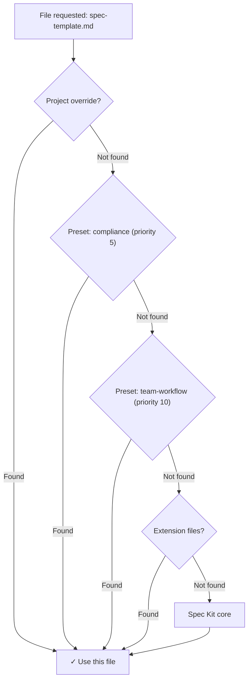

# SpecKit Preset and Workflow Patterns

**Source:** spec-kit watching repo (synthesized 2026-06-10)
**Purpose:** Quick reference for MATD preset and workflow development

## Key Patterns

### Presets
- **Resolution strategy**: Replace (default), prepend, append, wrap
- **Priority ordering**: Lower number = higher precedence (checked first)
- **File types**: templates/, commands/, scripts/
- **Stacking**: Multiple presets can be stacked, each file resolved independently
- **Override mechanism**: Project-local overrides in `.specify/templates/overrides/`
- **Catalog system**: Dual catalog (default + community), multi-catalog stack

### Workflows
- **Definition format**: YAML with schema_version 1.0
- **Execution model**: Sequential steps with nested control flow
- **Step types**: 10 built-in (command, prompt, shell, gate, if, switch, while, do-while, fan-out, fan-in)
- **State persistence**: Resume from exact step after pause/failure (`.specify/workflows/runs/{run_id}/`)
- **Expression engine**: Jinja2-like `{{ expression }}` with filters
- **Input resolution**: Type coercion (string, number, boolean, enum)

## Preset Manifest Structure

### Minimal Valid Manifest

```yaml
schema_version: "1.0"

preset:
  id: "lean"                      # Required: ^[a-z0-9-]+$
  name: "Lean Workflow"           # Required
  version: "1.0.0"                # Required: semantic version
  description: "Brief description" # Required
  author: "github"                # Required
  repository: "https://github.com/github/spec-kit" # Required
  license: "MIT"                  # Required

requires:
  speckit_version: ">=0.6.0"      # Required

provides:
  templates:
    - type: "command"             # Required: "command", "template", or "script"
      name: "speckit.specify"     # Required
      file: "commands/speckit.specify.md" # Required
      description: "Description"  # Required
      replaces: "speckit.specify" # Optional
```

### Full Manifest Fields

Source: `presets/README.md`

```yaml
schema_version: "1.0"

preset:
  id: string                      # ^[a-z0-9-]+$
  name: string
  version: string                 # X.Y.Z
  description: string
  author: string
  repository: string
  license: string
  homepage: string                # Optional

requires:
  speckit_version: string         # ">=X.Y.Z"

provides:
  templates:
    - type: string                # "command", "template", or "script"
      name: string
      file: string                # Relative path
      description: string
      replaces: string            # Optional: what this replaces
      strategy: string            # Optional: "replace", "prepend", "append", "wrap"

tags: [string]                    # Optional
```

## Template Resolution

### Resolution Stack

Source: `presets/ARCHITECTURE.md`

Priority order (highest to lowest):
1. **Project-local overrides** - `.specify/templates/overrides/`
2. **Installed presets** - sorted by priority (lower number = checked first)
3. **Installed extensions** - sorted by priority
4. **Spec Kit core** - `.specify/templates/`

### Resolution Flow



### File Type Organization

| Type      | Subdirectory   | Override path                              |
| --------- | -------------- | ------------------------------------------ |
| Templates | `templates/`   | `.specify/templates/overrides/`            |
| Commands  | `commands/`    | `.specify/templates/overrides/`            |
| Scripts   | `scripts/`     | `.specify/templates/overrides/scripts/`    |

## Composition Strategies

### Strategy Types

Source: `presets/ARCHITECTURE.md`

| Strategy | Description | Templates | Commands | Scripts |
|----------|-------------|-----------|----------|---------|
| `replace` (default) | Fully replaces lower-priority content | ✓ | ✓ | ✓ |
| `prepend` | Places content before lower-priority content (blank line separator) | ✓ | ✓ | — |
| `append` | Places content after lower-priority content (blank line separator) | ✓ | ✓ | — |
| `wrap` | Content contains placeholder replaced with lower-priority content | ✓ | ✓ | ✓ |

### Wrap Placeholders

- Templates/commands: `{CORE_TEMPLATE}`
- Scripts: `$CORE_SCRIPT`

### Composition Example

```yaml
# Preset 1 (priority 5)
provides:
  templates:
    - type: "template"
      name: "spec-template"
      file: "templates/spec-template.md"
      strategy: "prepend"  # Adds content before core

# Preset 2 (priority 10)
provides:
  templates:
    - type: "template"
      name: "spec-template"
      file: "templates/spec-template.md"
      strategy: "append"   # Adds content after preset 1 + core
```

Composition is recursive - multiple composing presets chain.

## Preset Directory Structure

### Standard Preset Layout

```
.specify/presets/{preset-id}/
├── preset.yml                  # Manifest
├── commands/                   # Command overrides
│   └── *.md
├── templates/                  # Template overrides
│   └── *.md
└── scripts/                    # Script overrides
    └── *.sh
```

### Repository Root Layout

```
spec-kit-my-preset/
├── README.md
├── LICENSE
├── CHANGELOG.md
├── preset.yml
├── commands/
├── templates/
└── scripts/
```

## Preset Catalog System

### Catalog Resolution Order

Source: `presets/ARCHITECTURE.md`

1. `SPECKIT_PRESET_CATALOG_URL` environment variable (single catalog)
2. Project config (`.specify/preset-catalogs.yml`)
3. User config (`~/.specify/preset-catalogs.yml`)
4. Built-in defaults (default + community)

### Catalog Config Format

```yaml
catalogs:
  - name: "default"
    url: "https://raw.githubusercontent.com/github/spec-kit/main/presets/catalog.json"
    priority: 1
    install_allowed: true
    description: "Built-in catalog"

  - name: "community"
    url: "https://raw.githubusercontent.com/github/spec-kit/main/presets/catalog.community.json"
    priority: 2
    install_allowed: false
    description: "Community presets (discovery only)"
```

### Catalog Entry Format

```json
{
  "schema_version": "1.0",
  "updated_at": "2026-01-28T14:30:00Z",
  "presets": {
    "lean": {
      "id": "lean",
      "name": "Lean Workflow",
      "description": "Minimal core workflow",
      "author": "github",
      "version": "1.0.0",
      "download_url": "https://github.com/.../lean-1.0.0.zip",
      "repository": "https://github.com/github/spec-kit",
      "tags": ["lean", "minimal", "workflow"]
    }
  }
}
```

## Command Registration for Presets

### Registration vs. Resolution

Source: `presets/ARCHITECTURE.md`

- Commands are **registered at install time** (not resolved through stack)
- Templates are **resolved at runtime** through the priority stack
- Registration happens for all detected agent directories

### Agent Format Support

Same as extensions (15+ agents):

| Agent | Format | Extension | Arg placeholder |
|-------|--------|-----------|-----------------|
| Claude, Cursor, opencode, Windsurf | Markdown | `.md` | `$ARGUMENTS` |
| Copilot | Markdown | `.agent.md` + `.prompt.md` | `$ARGUMENTS` |
| Gemini, Qwen, Tabnine | TOML | `.toml` | `{{args}}` |

### Extension Safety Check

When preset provides command with 3+ dot segments (`speckit.{ext}.{cmd}`):
- Extract extension ID
- Check if `.specify/extensions/{ext-id}/` exists
- Skip if extension not installed (prevents orphan commands)

Core commands (2 segments): always registered

## Workflow Definition

### Minimal Valid Workflow

```yaml
schema_version: "1.0"

workflow:
  id: "my-workflow"               # Required
  name: "My Workflow"             # Required
  version: "1.0.0"                # Required
  author: "Author"                # Required
  description: "Brief description" # Required

requires:
  speckit_version: ">=0.7.2"      # Required

inputs: {}                        # Optional

steps:
  - id: "step1"                   # Required
    command: "speckit.specify"    # Required for command type
    integration: "claude"         # Required for command type
```

### Full Workflow Schema

Source: `docs/reference/workflows.md`, `workflows/ARCHITECTURE.md`

```yaml
schema_version: "1.0"

workflow:
  id: string                      # Required
  name: string                    # Required
  version: string                 # Required: X.Y.Z
  author: string                  # Required
  description: string             # Required

requires:
  speckit_version: string         # Required: ">=X.Y.Z"
  integrations:                   # Optional
    any: [string]                 # One of these integrations required

inputs:                           # Optional
  input_name:
    type: string                  # "string", "number", "boolean"
    required: boolean             # Default: false
    default: any                  # Default value
    prompt: string                # Interactive prompt text
    enum: [string]                # Valid values for validation

steps:
  - id: string                    # Required: unique step ID
    type: string                  # Optional: default "command"
    command: string               # For command type
    integration: string           # For command/prompt type
    input:                        # Optional: inputs to step
      args: string                # Supports {{ expressions }}
    condition: string             # Optional: {{ expression }}
    on_reject: string             # For gate: "abort", "skip", etc.
```

## Workflow Step Types

### Built-in Step Types

Source: `workflows/ARCHITECTURE.md`

| Type Key | Class | Purpose | Returns next_steps? |
|----------|-------|---------|---------------------|
| `command` | CommandStep | Invoke Spec Kit command | No |
| `prompt` | PromptStep | Send inline prompt to agent | No |
| `shell` | ShellStep | Run shell command | No |
| `gate` | GateStep | Human review/approval | No (pauses) |
| `if` | IfThenStep | Conditional branching | Yes |
| `switch` | SwitchStep | Multi-branch dispatch | Yes |
| `while` | WhileStep | Loop while condition true | Yes (if true) |
| `do-while` | DoWhileStep | Loop, runs body once min | Yes (always) |
| `fan-out` | FanOutStep | Dispatch per item | No (engine expands) |
| `fan-in` | FanInStep | Aggregate fan-out results | No |

### Step Definition Examples

**Command step**:
```yaml
- id: specify
  command: speckit.specify
  integration: "{{ inputs.integration }}"
  input:
    args: "{{ inputs.spec }}"
```

**Gate step**:
```yaml
- id: review-spec
  type: gate
  message: "Review the generated spec before planning."
  options: [approve, reject]
  on_reject: abort
```

**If step**:
```yaml
- id: conditional
  type: if
  condition: "{{ steps.test.output.exit_code == 0 }}"
  then:
    - id: success-step
      shell: "echo 'Tests passed'"
  else:
    - id: failure-step
      shell: "echo 'Tests failed'"
```

**Shell step**:
```yaml
- id: test
  type: shell
  command: "npm test"
  capture_output: true
```

**While loop**:
```yaml
- id: retry-loop
  type: while
  condition: "{{ steps.check.output.exit_code != 0 }}"
  body:
    - id: check
      type: shell
      command: "curl -f https://api.example.com/health"
```

## Workflow Expression Engine

### Expression Syntax

Source: `workflows/ARCHITECTURE.md`

Jinja2-like `{{ expression }}` with:

| Feature | Syntax | Example |
|---------|--------|---------|
| Variable access | `{{ inputs.name }}` | Dot-path traversal |
| Step outputs | `{{ steps.plan.output.file }}` | Access previous results |
| Comparisons | `==`, `!=`, `>`, `<`, `>=`, `<=` | `{{ count > 5 }}` |
| Boolean logic | `and`, `or`, `not` | `{{ items and status == 'ok' }}` |
| Membership | `in`, `not in` | `{{ 'error' not in status }}` |
| Literals | strings, numbers, booleans, lists | `{{ true }}`, `{{ [1, 2] }}` |

### Expression Filters

| Filter | Syntax | Purpose |
|--------|--------|---------|
| `default` | `{{ val \| default('fallback') }}` | Fallback for None/empty |
| `join` | `{{ list \| join(', ') }}` | Join list elements |
| `contains` | `{{ text \| contains('sub') }}` | Substring/membership check |
| `map` | `{{ list \| map('attr') }}` | Extract attribute from each item |

### Expression Namespace

| Key | Source | Available when |
|-----|--------|----------------|
| `inputs` | Resolved workflow inputs | Always |
| `steps` | Accumulated step results | After first step |
| `item` | Current iteration item | Inside fan-out |
| `fan_in` | Aggregated results | Inside fan-in |

### Expression Forms

- **Single expressions**: `{{ expr }}` returns typed values
- **Mixed templates**: `"text {{ expr }} more"` returns interpolated strings

## Workflow Input Types

### Type Coercion

Source: `workflows/ARCHITECTURE.md`

| Declared Type | Coercion | Example |
|---------------|----------|---------|
| `string` | Pass-through | `"my-feature"` |
| `number` | `float()` → `int()` if whole | `"42"` → `42` |
| `boolean` | `"true"/"1"/"yes"` → `True` | `"false"` → `False` |
| `enum` | Validates against allowed values | `["full", "backend-only"]` |

### Input Definition Example

```yaml
inputs:
  spec:
    type: string
    required: true
    prompt: "Describe what you want to build"
  
  integration:
    type: string
    default: "copilot"
    prompt: "Integration to use (e.g. claude, copilot, gemini)"
  
  scope:
    type: string
    default: "full"
    enum: ["full", "backend-only", "frontend-only"]
  
  parallel:
    type: boolean
    default: false
```

## Workflow State Management

### State Persistence

Source: `workflows/ARCHITECTURE.md`

**Locations**:
```
.specify/workflows/runs/{run_id}/
├── state.json          # Current run state and progress
├── inputs.json         # Resolved input values
└── log.jsonl          # Step-by-step execution log
```

**state.json format**:
```json
{
  "run_id": "662bf791",
  "workflow_id": "build-and-review",
  "status": "paused",
  "current_step_index": 2,
  "step_results": {
    "step1": {
      "status": "completed",
      "output": {...}
    }
  }
}
```

### Run States

```
CREATED → RUNNING → {COMPLETED | PAUSED | FAILED | ABORTED}
                     
PAUSED --resume()--> RUNNING
FAILED --resume()--> RUNNING
```

### Resume Behavior

Source: `docs/reference/workflows.md`

```bash
specify workflow resume <run_id> --input cmd="exit 0"
```

- Restores context from state.json
- Merges new `--input` values over stored inputs
- Re-validates against workflow input types
- Continues from paused/failed step

**Note**: Resume tracking at top-level step index only. Nested steps inside control flow re-run parent step.

## Workflow Catalog System

### Catalog Resolution Order

Same as presets:
1. `SPECKIT_WORKFLOW_CATALOG_URL` environment variable
2. Project config (`.specify/workflow-catalogs.yml`)
3. User config (`~/.specify/workflow-catalogs.yml`)
4. Built-in defaults (default + community)

### Workflow Installation

```bash
specify workflow add <source>
```

- `source` can be catalog ID, URL, or local file path
- Downloads workflow YAML from catalog `url` field
- Installs to `.specify/workflows/{id}/workflow.yml`
- Updates `.specify/workflows/workflow-registry.json`

### Registry Format

```json
{
  "schema_version": "1.0",
  "workflows": {
    "speckit": {
      "id": "speckit",
      "name": "Full SDD Cycle",
      "version": "1.0.0",
      "installed_at": "2026-01-28T14:30:00Z",
      "source": "catalog"
    }
  }
}
```

## Preset vs. Extension vs. Workflow

### Comparison Table

| Feature | Presets | Extensions | Workflows |
|---------|---------|------------|-----------|
| **Purpose** | Override templates/commands | Add new capabilities | Automate multi-step processes |
| **Stacking** | Multiple, priority-ordered | Multiple, independent | Single workflow per run |
| **Resolution** | Runtime (templates), install-time (commands) | Install-time (commands) | Parse-time (definition) |
| **File types** | templates/, commands/, scripts/ | commands/, scripts/, docs/ | workflow.yml only |
| **Hooks** | No | Yes (before/after events) | No (internal gates) |
| **Config** | No | Yes (layered config) | Yes (inputs) |
| **Composition** | Yes (prepend/append/wrap) | No | Yes (nested steps) |
| **Distribution** | Catalog + ZIP | Catalog + ZIP | Catalog + YAML |

### Use Cases

**Presets**:
- Enforce organizational standards (terminology, format)
- Customize core workflow for methodology (lean, agile)
- Localize experience (language, region)
- Override specific templates without full extension

**Extensions**:
- Integrate external tools (Jira, Linear, GitHub)
- Add domain-specific commands (bug triage, git workflow)
- Hook into workflow events (auto-commit, issue sync)
- Provide configuration-driven features

**Workflows**:
- Automate full SDD cycle (specify → plan → tasks → implement)
- Chain commands with review gates
- Conditional branching based on results
- Loop until condition met (retry logic)
- Fan-out parallel tasks (per-module processing)

## Quick Reference

### Preset Checklist

- [ ] `schema_version: "1.0"`
- [ ] `preset.id` follows `^[a-z0-9-]+$`
- [ ] `preset.version` is semantic (X.Y.Z)
- [ ] `requires.speckit_version` specified
- [ ] `provides.templates` defined with type, name, file
- [ ] Strategy specified if not default replace
- [ ] Files organized by type (templates/, commands/, scripts/)

### Workflow Checklist

- [ ] `schema_version: "1.0"`
- [ ] `workflow.id` is unique
- [ ] `workflow.version` is semantic
- [ ] `requires.speckit_version` specified
- [ ] `steps` is non-empty array
- [ ] Each step has unique `id`
- [ ] Command steps specify `integration`
- [ ] Gate steps have clear `message` and `options`
- [ ] Inputs have proper types and defaults
- [ ] Expressions use correct namespace (inputs., steps.)

### Preset Installation

```bash
# From catalog
specify preset add lean

# From URL
specify preset add --from https://example.com/preset.zip

# From local path (dev)
specify preset add --dev /path/to/preset

# With priority
specify preset add lean --priority 5
```

### Workflow Execution

```bash
# Run workflow
specify workflow run speckit -i spec="Build kanban board" -i scope=full

# With JSON output (machine-readable)
specify workflow run my-pipeline.yml --json

# Resume paused workflow
specify workflow resume <run_id> --input cmd="exit 0"

# Check status
specify workflow status <run_id>
```

## Common Patterns

### Lean Preset Example

From `presets/lean/preset.yml`:

```yaml
provides:
  templates:
    - type: "command"
      name: "speckit.specify"
      file: "commands/speckit.specify.md"
      description: "Lean specify - create spec.md from feature description"
      replaces: "speckit.specify"
    
    - type: "command"
      name: "speckit.plan"
      file: "commands/speckit.plan.md"
      description: "Lean plan - create plan.md from spec"
      replaces: "speckit.plan"
```

### Full SDD Workflow Example

From `docs/reference/workflows.md`:

```yaml
workflow:
  id: "speckit"
  name: "Full SDD Cycle"
  description: "Runs specify → plan → tasks → implement with review gates"

inputs:
  spec:
    type: string
    required: true
    prompt: "Describe what you want to build"

steps:
  - id: specify
    command: speckit.specify
    integration: "{{ inputs.integration }}"
    input:
      args: "{{ inputs.spec }}"

  - id: review-spec
    type: gate
    message: "Review the generated spec before planning."
    options: [approve, reject]
    on_reject: abort

  - id: plan
    command: speckit.plan
    integration: "{{ inputs.integration }}"
    input:
      args: "{{ inputs.spec }}"
```

### Composition Strategy Example

```yaml
# Preset with wrap strategy
provides:
  templates:
    - type: "template"
      name: "spec-template"
      file: "templates/spec-wrapper.md"
      strategy: "wrap"
```

**File content**:
```markdown
## Custom Header

{CORE_TEMPLATE}

## Custom Footer
```

Result: Custom header + core template + custom footer

## Ambiguities and Gaps

### Clarified

1. **Resolution timing**: Presets resolve templates at runtime; commands register at install time
2. **Composition recursion**: Multiple composing presets chain bottom-up through priority stack
3. **Resume granularity**: Top-level step index only; nested steps inside control flow re-run parent
4. **Expression forms**: Single `{{ expr }}` returns typed value; mixed `"text {{ expr }}"` returns string
5. **State persistence**: After every step to enable resume from exact point

### Remaining Gaps

1. **Preset composition edge cases**: How do multiple wraps interact? Order of application unclear
2. **Workflow nested resume**: No step-path stack for exact resume within control flow structures
3. **Expression filter extensibility**: Can users define custom filters? Not documented
4. **Workflow error handling**: Retry logic, timeout behavior not fully specified
5. **Catalog caching**: TTL and invalidation rules not clearly defined for presets/workflows

## Recommendations for Spec 013

Based on these patterns, for MATD development:

1. **Use presets for customization**: Override core templates without full extension overhead
2. **Leverage composition**: Prepend/append/wrap for incremental changes to core behavior
3. **Workflows for automation**: Chain MATD commands with gates for human-in-the-loop
4. **Expression power**: Use filters and conditionals for dynamic behavior
5. **State management**: Design workflows assuming resume capability from any step
6. **Input validation**: Define strict input types with enums for safety
7. **Priority ordering**: Use low numbers (1-5) for critical presets that must take precedence
8. **Multi-agent support**: Test preset command registration across Claude, Copilot, Gemini
9. **Catalog distribution**: Create team catalog for controlled preset/workflow distribution
10. **Documentation in files**: Make templates/commands self-documenting for clarity
