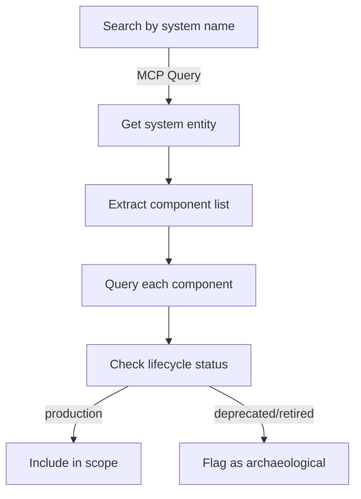

# Stonehenge API Access

**Source:** Confluence research + codebase search (2026-06-10)  
**Status:** Documented  
**Primary Reference:** [Confluence PAAS/188953706 - Stonehenge APIs](https://stepstone.atlassian.net/wiki/spaces/PAAS/pages/188953706)

## Executive Summary

Stonehenge is StepStone's internal developer portal built on Backstage.io. It maintains a catalog of systems, components, APIs, teams, and infrastructure. **Direct API queries are deprecated** due to performance issues. The recommended approach is:

1. **For reporting/analytics**: Use Grafana data source `stonehenge-reporting`
2. **For programmatic access (MCP/AI tools)**: Use the Stonehenge MCP server
3. **For one-off queries**: Use the Backstage catalog API (with caution)

## API Endpoints

### Base URL
```
https://stonehenge.stepstone.tools/api/catalog/
```

### Key Endpoints

| Endpoint | Purpose | Status |
|----------|---------|--------|
| `/api/catalog/entities/by-query` | Query catalog entities | ⚠️ Deprecated for reporting |
| `/api/catalog/validate-entity` | Validate entity YAML before registration | Active |

### Authentication
- **Browser Access**: Okta SSO (corporate network)
- **MCP Server**: Network-based auth (handled automatically)
- **Direct API**: No explicit API keys (relies on session/network auth)

## Component Count Query

### Via MCP (Recommended for AI/Automation)
```sql
SELECT COUNT(*) as component_count 
FROM stonehenge 
WHERE kind = 'Component'
```

### Via Direct API (Not Recommended)
```bash
curl "https://stonehenge.stepstone.tools/api/catalog/entities/by-query?filter=kind=component" \
  | jq '. | length'
```

### Via Grafana Data Source (Recommended for Dashboards)
```sql
SELECT COUNT(DISTINCT "metadata.name") as total_components
FROM "stonehenge-reporting-database"."stonehenge"
WHERE kind = 'Component'
  AND year = 2026
  AND month = '06'
  AND day = 10
```

## Entity Types in Catalog

| Kind | Description | Example Query |
|------|-------------|---------------|
| `Component` | Services, lambdas, libraries, APIs, websites | `filter=kind=component` |
| `System` | Logical grouping of components | `filter=kind=system` |
| `API` | API specifications/contracts | `filter=kind=api` |
| `Group` | Teams and organizational units | `filter=kind=group` |
| `Domain` | Business domains | `filter=kind=domain` |
| `Resource` | Infrastructure resources | `filter=kind=resource` |

## MCP Tool Status

### ✅ Existing MCP Server

**Location:** Found in `agentic-pdlc-workspace` (StepStone internal workspace)  
**Server Name:** `stonehenge-mcp`  
**URL:** `https://stonehenge-mcp.ds.daas.stepstone.com/mcp`  
**Transport:** HTTP  
**Auth:** None at MCP layer (server authenticates via user network)

### Installation
```bash
# User-scope installation (Claude Code)
claude mcp add --transport http stonehenge https://stonehenge-mcp.ds.daas.stepstone.com/mcp/

# OR project-scope (.mcp.json)
{
  "mcpServers": {
    "stonehenge-mcp": {
      "url": "https://stonehenge-mcp.ds.daas.stepstone.com/mcp",
      "type": "http",
      "env": {}
    }
  }
}
```

### MCP Tool Reference
- **Primary Tool:** `mcp__stonehenge-mcp__execute_query`
- **Purpose:** SQL queries over Stonehenge catalog and reporting database
- **Tables Available:**
  - `stonehenge` - main catalog entities
  - `entity_scans` - health check scan results
  - `check_results` - individual check results
  - `activity` - API activity metrics
  - `stash` - repository catalog adoption status

### Query Examples (via MCP)

**Get component by name:**
```sql
SELECT "metadata.name", "spec.owner", "spec.system", "spec.type", "spec.lifecycle"
FROM stonehenge
WHERE kind = 'Component' AND "metadata.name" = 'my-service'
```

**Count components per system:**
```sql
SELECT "spec.system", COUNT(*) as component_count
FROM stonehenge
WHERE kind = 'Component' AND "spec.system" IS NOT NULL
GROUP BY "spec.system"
ORDER BY component_count DESC
LIMIT 20
```

**Find all components owned by a team:**
```sql
SELECT "metadata.name", "spec.system", "spec.type"
FROM stonehenge
WHERE kind = 'Component' AND "spec.owner" = 'group:default/team-automation'
```

### SQL Query Patterns
See reference: `agentic-pdlc-workspace/mcp-servers/stonehenge-mcp/sql-cheatsheet.md`

## Grafana Reporting Database

**⚠️ CRITICAL:** Direct Stonehenge API queries cause memory issues and service instability. Use Grafana data source instead.

### Connection Details
- **Data Source Name:** `stonehenge-reporting`
- **Database:** `stonehenge-reporting-database`
- **Catalog:** `AwsDataCatalog`
- **Region:** `eu-west-1`
- **Backend:** AWS Athena

### Available Tables

1. **`stonehenge`** - Enriched catalog metadata (partitioned by year/month/day)
2. **`entity_scans`** - Entity scan runs with pass/fail counts
3. **`check_results`** - Individual check results per scan
4. **`activity`** - Request counts and user agent statistics
5. **`stash`** - Build and catalog adoption info

### Example Grafana Dashboard
[PI Data Overview Dashboard](https://grafana.stepstone.tools/d/bda3fd4a-8481-4d33-8677-772c99e00d87/pi-data)

## Backstage.io Standard API Patterns

Stonehenge follows [Backstage.io catalog API conventions](https://backstage.io/docs/features/software-catalog/software-catalog-api):

### Query Syntax
```
/api/catalog/entities/by-query?filter=<field>=<value>,<field2>=<value2>
```

### Common Filters
```
# All systems
filter=kind=system

# Critical systems
filter=kind=system,metadata.labels.business-impact=critical

# Systems in domain
filter=kind=system,spec.domain=IncidentManagement

# Components of a system
filter=spec.System=Stonehenge

# Components with annotation
filter=metadata.annotations.sonarqube.org/project-key

# Specific entity
filter=metadata.name=stonehenge
```

### Entity Reference Format
```
<kind>:<namespace>/<name>
```
Examples:
- `component:default/pythia-service`
- `system:default/marketplace`
- `group:default/team-automation`

## Component Discovery Workflow

For finding components in a system:



### SQL Example
```sql
-- Step 1: Find system
SELECT "metadata.name", "spec.owner"
FROM stonehenge
WHERE kind = 'System' AND "metadata.name" LIKE '%marketplace%'

-- Step 2: Find components in system
SELECT "metadata.name", "spec.type", "spec.lifecycle", "spec.owner"
FROM stonehenge
WHERE kind = 'Component' AND "spec.system" = 'marketplace'

-- Step 3: Filter by lifecycle
SELECT "metadata.name", "spec.type"
FROM stonehenge
WHERE kind = 'Component' 
  AND "spec.system" = 'marketplace'
  AND "spec.lifecycle" IN ('production', 'development')
```

## Key Metadata Fields

### Component Spec
```yaml
spec:
  type: service|library|website|api|lambda|worker|terraform
  owner: group:default/team-name
  lifecycle: production|development|experimental|deprecated|retired
  system: parent-system-name
  dependsOn:
    - component:default/dependency-name
  providesApis:
    - api:default/api-name
```

### Labels (metadata.labels)
- `tier`: backend|frontend|lambda|worker|fullstack
- `business-impact`: critical|major|minor|low
- `security-level`: critical|major|minor|low
- `gdpr-sensitive`: true|false
- `catalog-type`: technology|business

### Annotations (metadata.annotations)
- `jira/project-key`: Linked Jira project
- `sonarqube.org/project-key`: SonarQube project
- `grafana/tag-selector`: Grafana tag filter
- `sentry.io/project-slug`: Sentry project
- `support/slack-channel`: Support channel name

## Authentication Considerations

### For MCP Server
- No explicit credentials needed
- Authentication handled at network/infrastructure layer
- Assumes user is on corporate network or VPN
- SSO session may be required for first access

### For Direct API Access
- Browser-based: Okta SSO login required
- Programmatic: Session cookie or network-based auth
- No dedicated API keys or service accounts documented

## Performance Considerations

⚠️ **From Confluence PAAS/188953706:**
> Direct queries to the Stonehenge API are deprecated due to performance and stability concerns. Please use the Grafana data source `stonehenge-reporting` for all reporting needs.

### Why Direct API is Deprecated
1. Large dataset queries cause memory issues
2. Real-time catalog queries impact Backstage service stability
3. No query result caching
4. No rate limiting in place

### Recommended Alternatives
1. **Reporting/Analytics**: Grafana `stonehenge-reporting` data source
2. **AI/Automation**: Stonehenge MCP server (queries reporting DB, not live API)
3. **One-off queries**: Use with caution, prefer small result sets with specific filters

## Integration Examples

### Claude Code Agent Discovery
```python
# Via MCP tool in Claude Code
# Query: "Find all components in the marketplace system"

Result from: mcp__stonehenge-mcp__execute_query
SQL: SELECT "metadata.name", "spec.type", "spec.lifecycle" 
     FROM stonehenge 
     WHERE kind = 'Component' AND "spec.system" = 'marketplace'

# Returns: List of components with metadata
```

### Python Script (via API)
```python
import requests

def get_system_components(system_name):
    """Get components in a system (use sparingly, prefer MCP)"""
    url = "https://stonehenge.stepstone.tools/api/catalog/entities/by-query"
    params = {"filter": f"kind=component,spec.system={system_name}"}
    
    response = requests.get(url, params=params)
    return response.json()

# ⚠️ Note: This hits the live API. Prefer MCP server for automation.
```

### Grafana Dashboard Query
```sql
-- Component count by lifecycle status
SELECT 
  "spec.lifecycle" as status,
  COUNT(DISTINCT "metadata.name") as count
FROM "stonehenge-reporting-database"."stonehenge"
WHERE kind = 'Component'
  AND year = YEAR(CURRENT_DATE)
  AND month = LPAD(CAST(MONTH(CURRENT_DATE) AS VARCHAR), 2, '0')
GROUP BY "spec.lifecycle"
ORDER BY count DESC
```

## Open Questions

1. **Rate Limiting**: No documentation on rate limits for direct API access (may be why it's deprecated)
2. **API Keys**: No dedicated API key mechanism documented - relies on network/session auth
3. **Write Access**: Validate-entity endpoint exists, but write/update operations not documented
4. **Historical Data**: How far back does the reporting database retain data?
5. **Real-time vs Batch**: Reporting DB has partitions - what's the data freshness/lag?

## Related Documentation

- [Backstage.io Catalog API](https://backstage.io/docs/features/software-catalog/software-catalog-api)
- [Confluence: Stonehenge APIs](https://stepstone.atlassian.net/wiki/spaces/PAAS/pages/188953706)
- [Confluence: Reporting & Data Access](https://stepstone.atlassian.net/wiki/spaces/PAAS/pages/188953398)
- [Confluence: Stonehenge Quick Start](https://stepstone.atlassian.net/wiki/spaces/PAAS/pages/188953988)
- Local: `agentic-pdlc-workspace/mcp-servers/stonehenge-mcp/sql-cheatsheet.md`

## Summary for AI Tool Integration

**✅ Recommended Approach:**
1. Use existing MCP server: `https://stonehenge-mcp.ds.daas.stepstone.com/mcp`
2. Tool: `mcp__stonehenge-mcp__execute_query`
3. Query the `stonehenge` table (catalog data) or `entity_scans` (health data)
4. Use SQL patterns from `sql-cheatsheet.md`

**❌ Not Recommended:**
- Direct HTTP queries to `/api/catalog/entities/by-query` (causes performance issues)
- Creating a new MCP server (one already exists and is maintained)

**Component Count Example:**
```sql
SELECT COUNT(*) as total_components
FROM stonehenge
WHERE kind = 'Component' AND "spec.lifecycle" = 'production'
```

**System Inventory Lookup:**
```sql
SELECT "metadata.name", "spec.owner", "spec.domain"
FROM stonehenge
WHERE kind = 'System'
ORDER BY "metadata.name"
```
