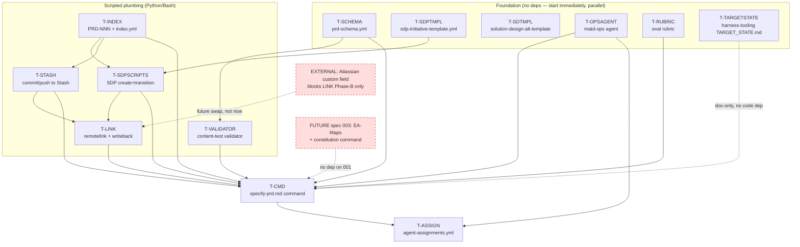

# Dependency Map — `speckit-matd-specify-prd`

Maps the implementation work into discrete tasks, shows what blocks what, and assigns tasks to
**MATD agent roles** for safe concurrent execution. Honors the spec's scripted/LLM split
(FR-060), file-based PRD layout, offered-not-automatic SDP, and the 4-step agent map (FR-041).

---

## 1. Task breakdown

Build-time tasks (who **builds the command**), not the runtime steps the command later executes.
Each task notes its primary builder agent role, story-point estimate, and the FRs it satisfies.

| ID | Task | Builds | Builder role¹ | SP | FRs |
|---|---|---|---|---|---|
| **T-SCHEMA** | `prd-schema.yml` — sections, `id_prefix`, `required`, `grill_prompts[]`, `validation_rules[]` (the SSOT; interpretation A) | `templates/prd-schema.yml` | matd-specifier (authoring) + matd-architect (structure) | 3 | FR-003, DP-2 |
| **T-VALIDATOR** | Deterministic content-test validator: required sections, well-formed IDs, no placeholder residue, metrics have baseline-or-TBC; exit≠0 on CRITICAL | `scripts/validate_prd_content.py` | matd-critical-thinker (gate design) + matd-dev (impl) | 5 | FR-030, FR-033 |
| **T-RUBRIC** | LLM eval rubric (hard-fail checks + scored criteria, adapted from `feature-prd-eval`: 6 HF + 16×0–2 /32) | `prompts/prd-eval-rubric.md` | matd-critical-thinker | 3 | FR-031 |
| **T-INDEX** | `index.yml` maintenance + `PRD-NNN` allocation (read `next_prd_seq`, create entry, bind `sdp_key`, write `stash_url`, reserve `specs[]`) | `scripts/allocate_prd_id.py`, `scripts/maintain_prd_index.py` | matd-dev (under matd-ops contract) | 5 | FR-008, FR-009 |
| **T-SDPTMPL** | `sdp-initiative-template.yml` field→JSON payload map (Domain, Goal, Category, team, sprint, dates) | `templates/sdp-initiative-template.yml` | matd-architect (field model) | 2 | FR-007, FR-052 |
| **T-SDPSCRIPTS** | Bundled SDP-creation scripts extracted from `stepstone-sdp-planning`/`stepstone-atlassian-skills`: create Initiative (`11110`)→To Do (`11092`)→transition `101`→Idea Backlog (`11256`), runtime transition lookup | `scripts/sdp/create_sdp_initiative.py` | matd-dev (under matd-ops contract) | 5 | FR-043, FR-050, FR-051, FR-052 |
| **T-STASH** | Stash commit/push scripts for `PRD-NNN-<slug>.md` + `.context.md` to the system workspace repo; precondition check repo exists | `scripts/sdp/commit_prd_to_stash.sh` | matd-dev (under matd-ops contract) | 3 | FR-053, FR-053a |
| **T-LINK** | Remote-link + SDP-key write-back: `POST .../remotelink` to PRD on Stash, write `sdp_key`/`initiative_link` back into PRD + re-commit; **abstracted** for custom-field swap | `scripts/sdp/link_prd_to_sdp.py` | matd-dev (under matd-ops contract) | 5 | FR-054, FR-052b, OQ-4 |
| **T-OPSAGENT** | NEW Haiku `matd-ops` agent definition (env/scripts/Atlassian/Stash; blunt; **no prose**) | `.agents/plugins/matd/agents/matd-ops.md` | matd-orchestrator (agent authoring) | 3 | FR-041a |
| **T-SDTMPL** | Alternative Solution Design template — StepStone 9-section (FR+NFR, 13 NFR prefixes) | `templates/solution-design-alt-template.md` | matd-architect | 3 | Goals §; SD-alt |
| **T-CMD** | The command file: orchestrates the 4 steps, wires schema→interview→validator→eval→SDP→Stash, progressive disclosure / token caps | `commands/specify-prd.md` | matd-specifier (authoring) | 8 | FR-001, FR-002, FR-004, FR-005, FR-006, FR-010, FR-011, FR-032, FR-060, FR-061 |
| **T-ASSIGN** | `agent-assignments.yml` wiring (step→agent, `assign`/`validate`/`execute`) + validation pass | `docs/specs/001-.../agent-assignments.yml` | matd-orchestrator | 3 | FR-040, FR-041, FR-042 |
| **T-TARGETSTATE** | (Cross-repo, parallel) `harness-tooling/TARGET_STATE.md` — MATD agent re-scoping + DESIGN-stage commands + Principle 7 | `submodules/harness-tooling/TARGET_STATE.md` | matd-architect | 3 | OQ-7, Cross-repo § |

¹ "Builder role" = which MATD agent **builds** this artifact. Distinct from the runtime
**executor** agent the command assigns at use-time (Step 1=matd-ops, 2=matd-specifier,
3=matd-critical-thinker, 4=matd-ops — FR-041).

**Total: ~54 SP** (T-TARGETSTATE is cross-repo, can defer without blocking the command).

---

## 2. Dependency graph



**Reading the graph**
- `T-SCHEMA` is the keystone for the authoring chain (`→VALIDATOR`, `→CMD`).
- `T-INDEX → T-STASH → T-LINK` and `T-INDEX + T-SDPTMPL → T-SDPSCRIPTS → T-LINK` form the
  scripted-plumbing chain (matd-ops domain).
- `T-CMD` is the **integration node** — it depends on nearly everything and is the last code task.
- `T-ASSIGN` is final wiring; needs `T-CMD` steps + `T-OPSAGENT` to exist.
- Dashed red = external/future, **not** on the critical path (Phase-A ships without them).

---

## 3. Parallelization plan

### Wave 0 — fully independent (max concurrency, no shared state)
Six tasks touch disjoint files and can run **simultaneously**:

| Task | File touched | Builder role | Conflict risk |
|---|---|---|---|
| T-SCHEMA | `templates/prd-schema.yml` | matd-specifier | none |
| T-SDPTMPL | `templates/sdp-initiative-template.yml` | matd-architect | none |
| T-SDTMPL | `templates/solution-design-alt-template.md` | matd-architect | none |
| T-OPSAGENT | `.agents/plugins/matd/agents/matd-ops.md` | matd-orchestrator | none |
| T-RUBRIC | `prompts/prd-eval-rubric.md` | matd-critical-thinker | none |
| T-TARGETSTATE | `harness-tooling/TARGET_STATE.md` (other repo) | matd-architect | none (different repo) |

> Two matd-architect tasks (SDPTMPL, SDTMPL, TARGETSTATE) are independent files — one agent does
> them serially, or assign to distinct architect-role agent instances. No shared state.

### Wave 1 — unblocked once Wave-0 keystones land
- **T-VALIDATOR** (needs `T-SCHEMA`) — matd-critical-thinker + matd-dev.
- **T-INDEX** (no schema dep; standalone) — matd-dev. *Can actually start in Wave 0*; placed here
  only because T-SDPSCRIPTS/T-STASH consume it. Independent file (`scripts/allocate_prd_id.py`,
  `scripts/maintain_prd_index.py`).

So **T-VALIDATOR and T-INDEX run concurrently** (different files, different roles).

### Wave 2 — scripted plumbing chain (matd-ops domain, partial parallelism)
- **T-SDPSCRIPTS** (needs T-INDEX + T-SDPTMPL) — matd-dev.
- **T-STASH** (needs T-INDEX) — matd-dev. **Runs concurrently with T-SDPSCRIPTS** (writes
  `scripts/sdp/commit_prd_to_stash.sh` vs `create_sdp_initiative.py` — disjoint files).
- **T-LINK** (needs T-SDPSCRIPTS + T-STASH) — **sequential after both**; it writes back into the
  PRD and re-commits, so it touches index + PRD + git — serialize to avoid index/git races.

### Wave 3 — integration (sequential, single owner)
- **T-CMD** (needs SCHEMA, VALIDATOR, RUBRIC, INDEX, SDPSCRIPTS, STASH, LINK, OPSAGENT) —
  **matd-specifier**, single owner. This is the integration node; do not parallelize internally.

### Wave 4 — wiring + validation
- **T-ASSIGN** (needs T-CMD steps + T-OPSAGENT) — matd-orchestrator, then `agent-assign.validate`
  pass (FR-042) before any execution.

### What N concurrent agents can do at peak (Wave 0)
Up to **6 agents in parallel** with zero shared-state conflict (disjoint files, disjoint roles).
Realistic steady-state is **3–4** given two architect-role tasks and the dev/critical-thinker
split. Token-efficiency note: keep matd-ops (Haiku) on the script tasks (T-INDEX, T-SDPSCRIPTS,
T-STASH, T-LINK build work delegated to matd-dev but governed by the ops contract); reserve the
smart matd-specifier for T-SCHEMA + T-CMD authoring only.

---

## 4. Sequential constraints (must NOT parallelize)

| Constraint | Reason |
|---|---|
| T-LINK after T-SDPSCRIPTS **and** T-STASH | Writes `sdp_key` back into PRD + index + re-commits → git/index race if concurrent with creators |
| T-CMD after all script + template + agent tasks | Integration node; references every artifact by path |
| T-ASSIGN after T-CMD + T-OPSAGENT | Cannot assign agents to steps that don't exist yet; validation needs agents present |
| Any two tasks writing `index.yml` or doing `git commit` | Shared-state: serialize all index mutations and all Stash commits |

---

## 5. Tasks blocked by open decisions / external dependencies

| Blocker | Type | Impact | Mitigation |
|---|---|---|---|
| **Atlassian custom field** (PRD↔SDP link option B) | External (Atlassian team) | Blocks only **Phase-B** of T-LINK | Ship **Phase-A remote-link now** (FR-054); keep link step abstracted so swap is config-only |
| **EA-Maps content** (spec 003 pending input) | Future / external | **No impact on 001** — only the future constitution command | T-CMD references constitution read-only (FR-010); absent → note & continue |
| **Spec 002 OQ-B1..B4** (project-brief schema) | Future stub | No impact on 001 | PRD reads `product/brief.md` if present, else continues |
| **Spec 003 OQ-C1..C6** (constitution schema/skill) | Future stub | No impact on 001 | Constitution is reference-only here |
| **System agent-workspace repo on Stash** | Precondition (org) | Blocks T-STASH/T-LINK **at runtime**, not at build | FR-053a: command stops with guidance if absent; StaffEng/EM provisions — command never creates it |
| **OQ-7 TARGET_STATE.md** | Decision (resolved: create) | Doc-only; no code dep | T-TARGETSTATE runs fully parallel in Wave 0 |

---

## 6. Agent-role mapping summary (per FR-040..043 + AGENT_SKILL_MATRIX)

| Role | Build-time tasks | Runtime step it owns | Skill basis (no role-specific bleed; baseline shared OK) |
|---|---|---|---|
| **matd-specifier** (smart, `.md`-only) | T-SCHEMA authoring, T-CMD | Step 2 — interview + author `prd.md`/`prd-context.md` | general-grill-me, general-grill-with-docs, arch-writing-plans, stdd-product-spec-formats |
| **matd-critical-thinker** (smart, read-only) | T-VALIDATOR gate design, T-RUBRIC | Step 3 — content tests / eval | review-check-correctness, general-grill-me, review-simplify-complexity |
| **matd-ops** (NEW Haiku, scripts/git, no prose) | governs T-INDEX, T-SDPSCRIPTS, T-STASH, T-LINK (built by matd-dev) | Steps 1 & 4 — scaffold, SDP create, Stash, write-back | general-rtk-usage, general-verification-before-completion, git skills (baseline only) |
| **matd-architect** | T-SDPTMPL, T-SDTMPL, T-TARGETSTATE | — (build-time only) | arch-c4-architecture, general-system-design, arch-writing-plans |
| **matd-orchestrator** | T-OPSAGENT, T-ASSIGN | — (assign/validate) | orchestrate-*, manage-command-creator, manage-skill-creator |
| **matd-dev** | implements script bodies for T-INDEX/SDPSCRIPTS/STASH/LINK/VALIDATOR | — | python-*, dev-tdd |

Shared **baseline** skills (`general-rtk-usage`, `general-verification-before-completion`,
`context-optimization`, git) are **accepted overlap** across all roles per Design Principle 5 —
only role-defining skills (`arch-*`, `dev-tdd`, `review-check-correctness`) are de-duplicated.

---

## 7. Critical path

```
T-SCHEMA → T-VALIDATOR → T-CMD → T-ASSIGN
```
with the **parallel plumbing chain** `T-INDEX → T-SDPSCRIPTS → T-LINK → T-CMD` running alongside
and converging at T-CMD. The longest dependency chain by SP:

`T-INDEX (5) → T-SDPSCRIPTS (5) → T-LINK (5) → T-CMD (8) → T-ASSIGN (3) = 26 SP`

T-CMD is the convergence/integration bottleneck — everything funnels into it, and it cannot start
until the validator, eval rubric, all four scripts, and the matd-ops agent exist. Optimizing
throughput = front-load Wave 0 (6-way parallel) and keep the plumbing chain (matd-ops/matd-dev)
moving concurrently with the authoring chain (matd-specifier/matd-critical-thinker) so both
converge ready at T-CMD.
