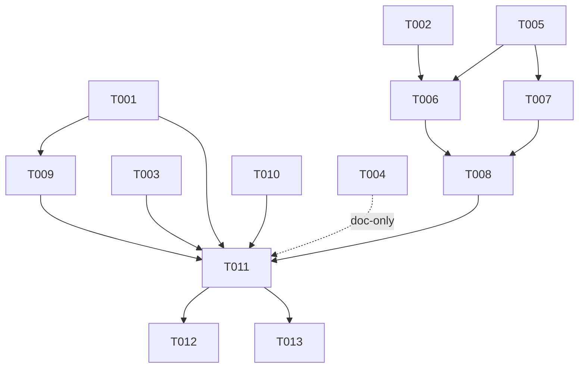

# Tasks: `speckit-matd-specify-prd` (v1 lean ~20–24 SP)

> **v1 scope** (per plan.md amendment, supersedes dependency-map.md):  
> **Cut**: T-OPSAGENT (matd-ops Haiku agent), T-ASSIGN (agent-assignments.yml + assign/validate/execute), T-SDTMPL (solution-design-alt-template → spec 004).  
> **Kept**: full `index.yml`, SDP-key write-back, structural validator (advisory), Jira config scaffold.  
> **Changed**: Command calls scripts directly (no matd-ops agent). Two smart agents at runtime only: `matd-specifier` + `matd-critical-thinker`.

All work lands in `submodules/harness-tooling/spec-kit-multi-agent-tdd/` unless noted otherwise.

---

## Phase 1 — Foundation: Schema & Templates (Wave 0, fully parallel)

> Independent files, no shared state. All can run simultaneously.

- [ ] T001 [P] Author `prd-schema.yml` with all 13 PRD sections, `id_prefix`, `required` flags, `grill_prompts[]`, and `validation_rules[]` (interpretation A: schema drives interview AND validation) → `spec-kit-multi-agent-tdd/templates/prd-schema.yml`
- [ ] T002 [P] Author `sdp-initiative-template.yml` mapping PRD fields to the Jira REST `fields` payload (summary, project=SDP, issuetype=11110, customfield_11259/11313/11389/10001; values resolved from workspace jira-config) → `spec-kit-multi-agent-tdd/templates/sdp-initiative-template.yml`
- [ ] T003 [P] Author `prd-eval-rubric.md` LLM evaluation rubric (6 hard-fail checks + 16 scored criteria ×0–2 /32; adapted from `feature-prd-eval`) → `spec-kit-multi-agent-tdd/prompts/prd-eval-rubric.md`
- [ ] T004 [P] Create `harness-tooling/TARGET_STATE.md` capturing: MATD agent skill re-scoping per AGENT_SKILL_MATRIX, DESIGN-stage commands as SpecKit commands+templates, two-tier harness-matd-core/-extensions model, Design Principle 7 → `submodules/harness-tooling/TARGET_STATE.md`

---

## Phase 2 — Scripted Plumbing: Index & SDP Scripts (Wave 1–2)

> T005 can start immediately (no schema dep). T006–T007 need T002+T005. T008 needs T006+T007.

- [ ] T005 Implement `allocate_prd_id.py` (reads `index.yml` → `next_prd_seq`, returns next `PRD-NNN`, increments counter atomically) and `maintain_prd_index.py` (create entry, bind `sdp_key` 1:1, write `stash_url`, reserve empty `specs[]`; IDs permanent, never renumber) → `spec-kit-multi-agent-tdd/scripts/allocate_prd_id.py` + `scripts/maintain_prd_index.py`
- [ ] T006 [P] Implement `create_sdp_initiative.py`: `jira_create_issue` (project=SDP, issuetype=11110, required custom fields from workspace jira-config) → resolve transitions at runtime via `GET /issue/{key}/transitions` (NOT hard-coded) → `jira_transition_issue` (transition → Idea Backlog id 11256); on failure surface key + manual-fix guidance → `spec-kit-multi-agent-tdd/scripts/sdp/create_sdp_initiative.py`
- [ ] T007 [P] Implement `commit_prd_to_stash.sh`: local `git add` + `git commit` of `product/prd/PRD-NNN-<slug>.md` + `product/context/PRD-NNN-<slug>.context.md`; precondition check that workspace repo exists (stop with guidance if not, FR-053a); human pushes (no auto-push, FR-053b) → `spec-kit-multi-agent-tdd/scripts/sdp/commit_prd_to_stash.sh`
- [ ] T008 Implement `link_prd_to_sdp.py`: `jira_create_remote_issue_link` (title "Source PRD — PRD-NNN", URL = PRD on Stash) + write `sdp_key`/`initiative_link` back into PRD frontmatter + re-commit (FR-052b); keep link step abstracted for Phase-B custom-field swap (FR-054); update `index.yml` `stash_url` + `sdp_key` → `spec-kit-multi-agent-tdd/scripts/sdp/link_prd_to_sdp.py`

---

## Phase 3 — Content Tests (Wave 1, parallel with T005)

> Needs T001 (schema). Can run concurrently with Phase 2 scripted plumbing.

- [ ] T009 Implement `validate_prd_content.py` deterministic content-test validator: required sections present (from schema), well-formed `REQ-NNN` IDs, no placeholder residue, success metrics have baseline-or-TBC; advisory in v1 (warns but does not hard-block — only frontmatter/section presence is CRITICAL); exit non-zero on CRITICAL finding → `spec-kit-multi-agent-tdd/scripts/validate_prd_content.py`

---

## Phase 4 — Jira Config Scaffold (Wave 0, independent)

- [ ] T010 [P] Ship Jira config scaffold (placeholder structure mirroring `jira-teams-config.yaml`: team ids, Stonehenge Domain options, Initiative Goal/Category, sprint, custom-field ids, transition ids — all blank/templated, OSS-safe); include clear comment that the live per-team config lives in the agent workspace only (never committed to marketplace) → `spec-kit-multi-agent-tdd/templates/jira-config-scaffold.yml`

---

## Phase 5 — Command Integration (Wave 3, sequential — integration node)

> Needs T001–T010 all complete. Single owner: matd-specifier role.

- [ ] T011 Author `specify-prd.md` command file orchestrating the fixed 4-step linear flow (FR-040):
  - **Step 1 (scripts):** scaffold PRD-NNN (call `allocate_prd_id.py`), load schema from `.specify/prd-schema.yml` or shipped default, load constitution at `architecture/system-constitution.md` (reference-only; note if absent), load `product/brief.md` if present; create `product/prd/` + `product/context/` dirs
  - **Step 2 (matd-specifier):** run grill interview section-by-section using schema `grill_prompts[]`, one section at a time, allow deferral to Open Questions; render concise `product/prd/PRD-NNN-<slug>.md` from collected answers; persist extended context to `product/context/PRD-NNN-<slug>.context.md`; surface relevant constitution invariants during interview (FR-011)
  - **Step 3 (matd-critical-thinker):** run `validate_prd_content.py` (structural, advisory); run `prd-eval-rubric.md` LLM eval (advisory); block SDP offer until zero CRITICAL structural findings (human override with audit trail, FR-032)
  - **Step 4 (scripts):** offer (not auto-create) SDP initiative → on confirm: `create_sdp_initiative.py` → `commit_prd_to_stash.sh` → `link_prd_to_sdp.py` → `maintain_prd_index.py` (bind sdp_key); update PRD + index with SDP key (FR-052b)
  - Progressive disclosure / token caps (FR-061): load only the schema section in play; cap validator output rows
  - Command location: `spec-kit-multi-agent-tdd/commands/specify-prd.md`

---

## Phase 6 — Polish & Verification

- [ ] T012 Verify command naming matches existing `specify-*` convention; verify workspace-local schema override path (`.specify/prd-schema.yml`) works; verify OSS-safe boundary (no corp IDs in shipped files); verify all scripts are importable / have correct shebang lines → read existing commands in `spec-kit-multi-agent-tdd/commands/` for convention check
- [ ] T013 Update `DOCUMENT_INDEX.md` to reflect spec 001 status change from STUB to implemented (🔄 → ✅) and add a note about `harness-tooling/TARGET_STATE.md` creation (T004) → `DOCUMENT_INDEX.md`

---

## Dependency Order

```
Wave 0 (parallel): T001, T002, T003, T004, T010
Wave 1 (unblocked): T005 (no dep), T009 (needs T001)
Wave 2 (scripted chain): T006 (needs T002+T005), T007 (needs T005) — concurrent
Wave 2 end: T008 (needs T006+T007) — sequential
Wave 3 (integration): T011 (needs T001–T010 all done)
Wave 4 (polish): T012, T013 (needs T011)
```



## Parallel Execution Summary

| Wave | Tasks | Max concurrency |
|---|---|---|
| 0 | T001, T002, T003, T004, T010 | 5 agents |
| 1 | T005, T009 | 2 agents |
| 2a | T006, T007 | 2 agents |
| 2b | T008 | 1 (serialize: index + git) |
| 3 | T011 | 1 (integration node) |
| 4 | T012, T013 | 2 agents |

**Critical path by SP:** T005(5) → T006(5) → T008(5) → T011(8) → T012(1) = **24 SP**

## Validation Checklist

- [ ] All FR-001..FR-061 are covered by at least one task
- [ ] No corp IDs embedded in any shipped file (OSS-safe, NFR-003)
- [ ] `prd-schema.yml` drives both interview (FR-004) and validator (FR-030)
- [ ] SDP creation offered, not automatic (FR-050)
- [ ] Transition id resolved at runtime, not hard-coded (FR-051)
- [ ] SDP-key write-back in both PRD frontmatter and index.yml (FR-052b)
- [ ] Human pushes to Stash — no auto-push (FR-053b)
- [ ] Structural validator is advisory in v1 (FR-033)
