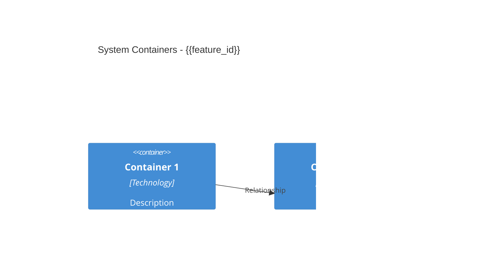
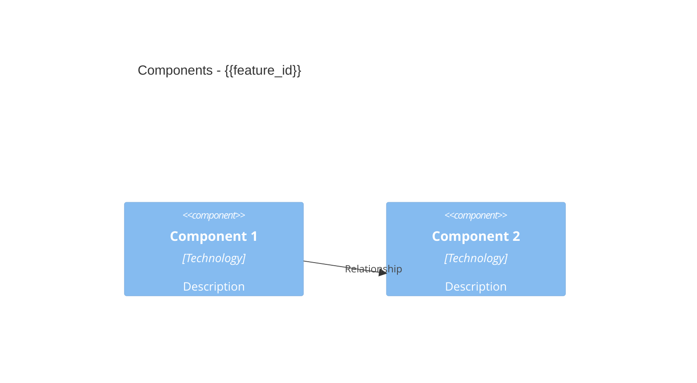
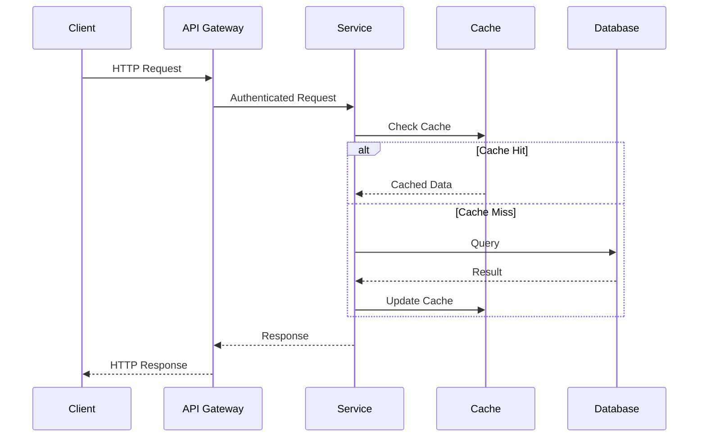
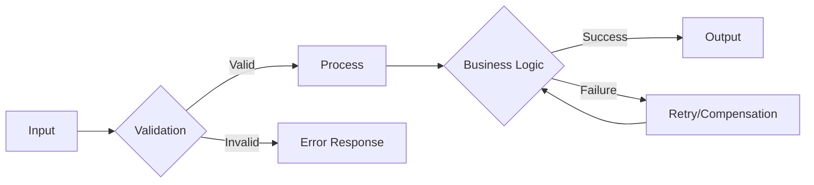
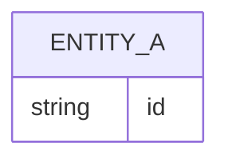
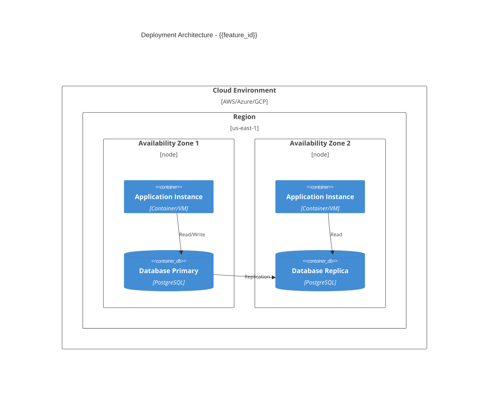

# Solution Design: {{feature_id}}

**Feature ID:** {{feature_id}}  
**Status:** {{status}}  
**Created:** {{timestamp}}  
**ADR Reference:** {{feature_id}}-adr.md

## Decomposition View

_Decompose the system into logical containers and components. Use C4 Context/Container/Component diagrams to visualize the structural hierarchy and boundaries of your solution._

### C2 Container Diagram

### C3 Component Diagram

## Dependency View

_Map out the dependencies between system components, both internal and external. Analyze coupling to identify tight dependencies and integration points._

### Internal Dependencies

_List intra-system dependencies (component-to-component relationships). Document the direction of dependency (A depends on B) and type (inheritance, composition, message passing, etc.)._

### External Dependencies

_Document external system dependencies, third-party libraries, APIs, and platform services. Include version constraints and integration patterns._

### Coupling Analysis

_Analyze the coupling characteristics: tight vs. loose, synchronous vs. asynchronous. Identify potential refactoring opportunities to reduce coupling._

## Interface View

_Define the boundary contracts between your system and external consumers, as well as internal subsystem interfaces. Include API signatures, event schemas, and protocol definitions._

### External API Contracts

_Document REST, gRPC, event-driven, or other external interface contracts. Include request/response schemas, error handling, and versioning strategy._

### Internal Interface Definitions

_Document public interfaces between internal components. Specify module boundaries, exported functions, or service contracts that other components depend on._

### Event Schemas

_(If applicable)_ _Document event structures for event-driven interactions. Include event names, payload schemas, and event flow diagrams._

## Security View

_Document security architecture, authentication mechanisms, data protection strategies, and threat mitigation._

### Authentication & Authorization

**Authentication Mechanisms:**
- _How users/services authenticate (OAuth2, JWT, API keys, etc.)_
- _Identity providers and SSO integration_
- _Session management strategy_

**Authorization Model:**
- _Role-based access control (RBAC), attribute-based (ABAC), or other model_
- _Permission granularity (resource-level, action-level)_
- _Authorization enforcement points (API gateway, service layer, data layer)_

### Data Protection

**Encryption:**
- _Encryption at rest: database, file storage, backups_
- _Encryption in transit: TLS versions, certificate management_
- _Key management strategy (KMS, HSM, manual rotation)_

**Sensitive Data Handling:**
- _PII identification and classification_
- _Data masking/redaction strategies_
- _Compliance requirements (GDPR, HIPAA, SOC2, etc.)_
- _Data retention and deletion policies_

### Threat Model

**Key Security Risks:**
1. _Threat 1: Description_
   - Mitigation: _How this threat is addressed_
   - Residual risk: _Remaining exposure_

2. _Threat 2: Description_
   - Mitigation: _How this threat is addressed_
   - Residual risk: _Remaining exposure_

3. _Threat 3: Description_
   - Mitigation: _How this threat is addressed_
   - Residual risk: _Remaining exposure_

**Security Testing:**
- _Penetration testing approach_
- _Vulnerability scanning strategy_
- _Security review process_

## Data Design View

_Specify how data flows through the system, data structures, and persistence strategies. Include entity-relationship models and key schemas._

### Data Flow Diagram

_Visualize how data moves through the system using sequence diagrams for key workflows._

**Primary Data Flow:**

**Alternative/Error Flow:**

### Entity-Relationship Diagram

### Key Schemas

_Document primary data structures, database schemas, cache structures, or message payloads. Include relationships between entities and any constraints._

## Deployment View

_Describe how components are deployed to runtime environments, including infrastructure, scaling strategy, and operational considerations._

### Deployment Architecture

### Infrastructure Components

**Compute:**
- _Container orchestration (Kubernetes, ECS, etc.) or VM-based deployment_
- _Instance types and sizing_
- _Auto-scaling configuration_

**Networking:**
- _Load balancing strategy (ALB, NLB, ingress controller)_
- _Network segmentation (VPC, subnets, security groups)_
- _DNS and service discovery_
- _CDN and edge caching_

**Storage:**
- _Database deployment (managed service vs self-hosted)_
- _File storage (object storage, block storage)_
- _Backup and replication strategy_

### Scaling Strategy

**Horizontal Scaling:**
- _Auto-scaling triggers (CPU, memory, request rate)_
- _Min/max instance counts_
- _Scale-out/scale-in policies_

**Vertical Scaling:**
- _Resource allocation per instance_
- _When to scale up vs scale out_

**Capacity Planning:**
- _Expected baseline load_
- _Peak load projections_
- _Growth trajectory (6 months, 1 year, 2 years)_

### Operational Considerations

**Monitoring & Observability:**
- _Metrics collection (Prometheus, CloudWatch, Datadog)_
- _Distributed tracing (Jaeger, X-Ray, Zipkin)_
- _Log aggregation (ELK, Splunk, CloudWatch Logs)_
- _Alerting strategy and thresholds_

**Health Checks:**
- _Liveness probes_
- _Readiness probes_
- _Startup probes_
- _Health check endpoints and criteria_

**Disaster Recovery:**
- _RTO (Recovery Time Objective)_
- _RPO (Recovery Point Objective)_
- _Backup strategy and frequency_
- _Failover procedures_
- _Multi-region deployment (if applicable)_

**Deployment Pipeline:**
- _CI/CD workflow_
- _Deployment strategy (blue-green, canary, rolling)_
- _Rollback procedures_
- _Environment promotion path (dev → staging → prod)_

---

**Verification Checklist:**
- [ ] All six views present: Decomposition, Dependency, Interface, Security, Data Design, Deployment
- [ ] C4Container diagram in Decomposition View
- [ ] C4Component diagram in Decomposition View
- [ ] C4Deployment diagram in Deployment View
- [ ] Sequence diagram in Data Flow
- [ ] Entity-Relationship Diagram in Data Design View
- [ ] All internal dependencies documented
- [ ] All external dependencies documented
- [ ] Coupling analysis complete
- [ ] External API contracts defined
- [ ] Internal interface definitions documented
- [ ] Event schemas defined (if applicable)
- [ ] Authentication & authorization documented
- [ ] Data protection strategy defined
- [ ] Threat model documented
- [ ] Scaling strategy defined
- [ ] Operational considerations addressed
- [ ] Disaster recovery plan documented
- [ ] All template variables replaced
